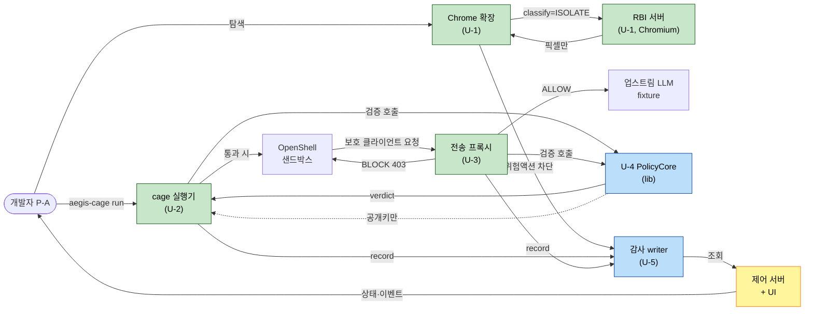

# AEGIS — Component Dependencies & Data Flow

작성일: 2026-09-07 | 단계: INCEPTION → Application Design

## 1. 의존 매트릭스 (행 → 열: 행이 열에 의존)
| ↓의존 \ 대상→ | contracts | U-4 Policy | U-5 Audit | U-3 Guard | U-2 Cage | U-1 Web | 제어서버 |
|---|---|---|---|---|---|---|---|
| **contracts** | — | | | | | | |
| **U-4 PolicyCore** | ✅ | — | | | | | |
| **U-5 AuditTrail** | ✅ | | — | | | | |
| **U-3 SecretGuard** | ✅ | ✅ | ✅ | — | | | |
| **U-2 AgentCage** | ✅ | ✅ | ✅ | (경유) | — | | |
| **U-1 WebIsolate** | ✅ | ✅ | ✅ | | | — | |
| **제어 서버** | ✅ | | ✅(조회) | (상태) | (상태) | (상태) | — |

- 방어 Unit(U-1/U-2/U-3) → U-4, U-5 **단방향**. U-4·U-5는 서로/방어 Unit 미참조. **순환 의존 없음**(NFR-6).
- U-2 → U-3: 코드 의존이 아니라 **런타임 경유**(보호 클라이언트가 프록시 통과, T-FLOW). 화살표는 참조가 아닌 트래픽.
- `contracts`는 모든 것의 최하위 공유 타입.

## 2. 통신 패턴 (Q1=A 하이브리드)
| 관계 | 패턴 | 비고 |
|---|---|---|
| 방어 Unit → U-4 검증 | **in-process 함수 호출** | 공유 라이브러리(Q3=A), 공개키만 |
| 방어 Unit → U-5 기록 | **loopback IPC**(AuditClient.emit → writer) | 단일 writer 프로세스(Q2=A) |
| 제어 서버 → U-5 조회 | in-process 또는 loopback | 상태·이벤트 집약(Q5=A) |
| 제어 서버 → 각 서비스 상태 | **loopback API** | 토큰/Origin/Host 검증 |
| 확장 ↔ RBI 서버 | **loopback 제어 메시지 + 픽셀** | 구조화 메시지만, HTML 삽입 금지 |
| 보호 클라이언트 → 프록시 → 업스트림 | **강제 경유 HTTP(S)** | 업스트림 TLS 검증, 지원 제공자 한정 |

## 3. 데이터 흐름 (D-1~D-3 종단)

**텍스트 대체 설명**:
- **D-1**: 개발자 탐색 → 확장이 ISOLATE 판정 → RBI 서버(원격 Chromium) → 확장에는 픽셀만. 위험 액션은 확장/RBI가 차단하고 감사 writer에 기록.
- **D-2**: 개발자 `aegis-cage run` → cage가 U-4 PolicyCore(in-process, 공개키만)로 서명·스키마 검증 → 통과 시에만 OpenShell 샌드박스 실행 → 감사 기록.
- **D-3**: 샌드박스 내 보호 클라이언트 → 전송 프록시(U-3) 강제 경유 → (탐지) BLOCK 403·업스트림 미전송 / (정상) ALLOW·업스트림 전달 → 감사 기록.
- 모든 판정·기록은 같은 workflow_id, 제어 서버가 상태·이벤트를 개발자에게 표시.

## 4. 데이터 계약(요약)
- **정책**: `PolicySnapshot{raw_bytes, digest}` + 서명 → `Judgment{policy_id, policy_version, policy_digest, pubkey_id, rule_id, verdict, reason_code}`.
- **감사 이벤트**: `AuditEvent{event_id, workflow_id, unit, verdict, reason_code, safe_location, target(host|command_label), recommended_action, ts, evidence_hash}` — **원문·비밀·인자·개인키 없음**(FR-5.2).
- **차단 응답(U-3)**: HTTP 403 `AEGIS_SECRET_BLOCKED` + event_id + rule_id + safe_location.

## 5. 일관성·검증 결론 (D-6)
- 순환 의존 없음(NFR-6): 방어 Unit → U-4/U-5 단방향, contracts 최하위.
- 독립 테스트 가능: 프록시·서명·감사 계약이 각각 분리(NFR-6). PBT 대상(contracts 직렬화, U-4 서명 bytes, U-3 탐지/복원, U-5 hash/동시성, U-1 URL/SSRF)을 인터페이스에 표기.
- Security(Full) 집행 지점: 프록시 강제경유·TLS·SSRF·서명검증·fail-closed 감사·loopback 인증. Resiliency=N/A(단일 장비).
- 선행 환경 검증 게이팅: V-1(U-2), V-2(U-4), V-3(U-3), V-4(U-1).
