# Execution Plan — AEGIS

작성일: 2026-09-07 | 단계: INCEPTION → Workflow Planning | 프로젝트: Greenfield · Complex · Comprehensive
반영: MVP 범위 Q1=A(핵심 보안 기능 경로 우선, 보안 집행형 NFR 포함·성능/사용성 NFR 유예) · 구현 순서 Q2=A(contracts+U-4/U-5 → U-3 → U-2 → U-1) · 확장(Security=Full, PBT=Partial, Resiliency=off).

## 1. Detailed Analysis Summary

### 1.1 Transformation Scope
- **유형**: Greenfield 신규 구축(기존 코드 없음 → Reverse Engineering 생략). 브라운필드 항목(모듈 조정·CDK·마이그레이션)은 N/A.

### 1.2 Change Impact Assessment
- **User-facing changes**: Yes — RBI 뷰어, 위험 액션 UI, cage CLI, 시크릿 차단 403 응답, 통합 상태 대시보드(§6).
- **Structural changes**: Yes — 5 Unit + 공통 `contracts` 신규 아키텍처, 의존 방향 `U-1/U-2/U-3 → U-4, U-5`.
- **Data model changes**: Yes — 공통 설정 스키마(schema_version=1), OpenShell policy(version=1), 감사 이벤트 JSONL, 공통 판정 계약(policy_id/version/digest/rule_id/verdict/reason_code).
- **API changes**: Yes — cage CLI, 프록시(mitmproxy) 계약, 제어 UI FastAPI, 확장↔RBI 제어 메시지.
- **NFR impact**: Yes — 보안 집행형 NFR(NFR-3/4/5/8/9/10)은 MVP 핵심. 성능(NFR-1/2)·사용성(NFR-12) 세부는 MVP 이후.

### 1.3 Risk Assessment
- **Risk Level**: **High** — 다중 실행 환경 보안 경계, fail-closed 요구, 암호(ML-DSA-65)·격리(OpenShell/Landlock) 런타임 민감(WSL2 게이팅 V-1/V-2), 잘못 구현 시 보안 보장 붕괴.
- **Rollback Complexity**: Moderate — Unit 경계로 격리, 단일 장비 로컬.
- **Testing Complexity**: Complex — D-1~D-3 종단, 고정 코퍼스 S/B, 경계·실패·통합 T-*, PBT 속성 시험, 환경 smoke test.

## 2. Workflow Visualization

```mermaid
flowchart TD
    Start(["User Request: AEGIS"])

    subgraph INCEPTION["INCEPTION PHASE"]
        WD["Workspace Detection<br/><b>COMPLETED</b>"]
        RE["Reverse Engineering<br/><b>SKIPPED</b>"]
        RA["Requirements Analysis<br/><b>COMPLETED</b>"]
        US["User Stories<br/><b>COMPLETED</b>"]
        WP["Workflow Planning<br/><b>IN PROGRESS</b>"]
        AD["Application Design<br/><b>EXECUTE</b>"]
        UG["Units Generation<br/><b>EXECUTE</b>"]
    end

    subgraph CONSTRUCTION["CONSTRUCTION PHASE (per-unit loop)"]
        FD["Functional Design<br/><b>EXECUTE</b>"]
        NFRA["NFR Requirements<br/><b>EXECUTE</b>"]
        NFRD["NFR Design<br/><b>EXECUTE</b>"]
        ID["Infrastructure Design<br/><b>EXECUTE</b>"]
        CG["Code Generation<br/><b>EXECUTE</b>"]
        BT["Build and Test<br/><b>EXECUTE</b>"]
    end

    subgraph OPERATIONS["OPERATIONS PHASE"]
        OPS["Operations<br/><b>PLACEHOLDER</b>"]
    end

    Start --> WD
    WD --> RE
    RE --> RA
    RA --> US
    US --> WP
    WP --> AD
    AD --> UG
    UG --> FD
    FD --> NFRA
    NFRA --> NFRD
    NFRD --> ID
    ID --> CG
    CG --> BT
    BT --> OPS
    OPS --> End(["Complete"])

    style WD fill:#4CAF50,stroke:#1B5E20,stroke-width:3px,color:#fff
    style RA fill:#4CAF50,stroke:#1B5E20,stroke-width:3px,color:#fff
    style US fill:#4CAF50,stroke:#1B5E20,stroke-width:3px,color:#fff
    style WP fill:#4CAF50,stroke:#1B5E20,stroke-width:3px,color:#fff
    style CG fill:#4CAF50,stroke:#1B5E20,stroke-width:3px,color:#fff
    style BT fill:#4CAF50,stroke:#1B5E20,stroke-width:3px,color:#fff
    style RE fill:#BDBDBD,stroke:#424242,stroke-width:2px,stroke-dasharray: 5 5,color:#000
    style AD fill:#FFA726,stroke:#E65100,stroke-width:3px,stroke-dasharray: 5 5,color:#000
    style UG fill:#FFA726,stroke:#E65100,stroke-width:3px,stroke-dasharray: 5 5,color:#000
    style FD fill:#FFA726,stroke:#E65100,stroke-width:3px,stroke-dasharray: 5 5,color:#000
    style NFRA fill:#FFA726,stroke:#E65100,stroke-width:3px,stroke-dasharray: 5 5,color:#000
    style NFRD fill:#FFA726,stroke:#E65100,stroke-width:3px,stroke-dasharray: 5 5,color:#000
    style ID fill:#FFA726,stroke:#E65100,stroke-width:3px,stroke-dasharray: 5 5,color:#000
    style OPS fill:#FFF59D,stroke:#F57F17,stroke-width:2px,color:#000
    style Start fill:#CE93D8,stroke:#6A1B9A,stroke-width:3px,color:#000
    style End fill:#CE93D8,stroke:#6A1B9A,stroke-width:3px,color:#000
    linkStyle default stroke:#333,stroke-width:2px
```

**텍스트 대체 설명**: 시작 → (INCEPTION) Workspace Detection[완료] → Reverse Engineering[생략] → Requirements Analysis[완료] → User Stories[완료] → Workflow Planning[진행중] → Application Design[실행] → Units Generation[실행] → (CONSTRUCTION, Unit별 반복) Functional Design → NFR Requirements → NFR Design → Infrastructure Design → Code Generation → Build and Test → (OPERATIONS) Operations[placeholder] → 완료.

## 3. Phases to Execute

### 🔵 INCEPTION PHASE
- [x] Workspace Detection (COMPLETED — Greenfield)
- [x] Reverse Engineering (SKIPPED — 기존 코드 없음)
- [x] Requirements Analysis (COMPLETED — 2026-09-07T07:30:50Z)
- [x] User Stories (COMPLETED — 2026-09-07T08:05:00Z)
- [x] Workflow Planning (IN PROGRESS)
- [ ] **Application Design — EXECUTE**
  - **Rationale**: 신규 5 Unit + `contracts` 컴포넌트·메서드·서비스 계층·의존 관계 정의 필요. Unit 간 인터페이스(정책 검증 계약, 감사 이벤트 계약, 프록시 계약)를 코드 생성 전에 확정해야 함.
- [ ] **Units Generation — EXECUTE**
  - **Rationale**: 시스템을 6개 작업 단위(contracts, U-4, U-5, U-3, U-2, U-1)로 분해. 구현 순서(Q2=A)와 의존성·계약 경계를 Unit 문서로 고정. Construction per-unit loop의 입력.

### 🟢 CONSTRUCTION PHASE (각 Unit마다 순차 실행 — Q2=A 순서)
- [ ] **Functional Design — EXECUTE (per-unit)**
  - **Rationale**: 신규 데이터 모델·스키마(policy.yaml, 이벤트 JSONL, contracts 타입)와 복잡한 비즈니스 로직(시크릿 탐지, ML-DSA 서명 bytes, SSRF 판정, fail-closed 상태기계) 상세 설계 필요.
- [ ] **NFR Requirements — EXECUTE (per-unit)**
  - **Rationale**: 보안 집행형 NFR(NFR-3/4/5/8/9/10)이 기능의 본질(MVP 포함). 기술 스택은 C-DEP-1로 대부분 확정 — 재선택 대신 각 Unit별 적용 NFR·수용 임계 확정. 성능(NFR-1/2)·사용성(NFR-12) 세부는 목표로 표기하되 MVP 이후 튜닝(Q1=A).
- [ ] **NFR Design — EXECUTE (per-unit)**
  - **Rationale**: NFR Requirements 실행됨 → fail-closed, TLS 미해제, 단일 writer, 데이터 최소화 패턴을 설계에 반영. Security Baseline(Full)·PBT(Partial) 차단성 제약 적용.
- [ ] **Infrastructure Design — EXECUTE (per-unit)**
  - **Rationale**: 로컬 단일 장비지만 실제 인프라 요소 존재 — RBI Chromium 서버, mitmproxy 프록시·로컬 CA 신뢰 범위, OpenShell 실행 격리(V-1), 감사 저장소(ext4 JSONL). 경량이나 명시 필요. V-3/V-4 검증 이 단계에서 수행.
- [ ] **Code Generation — EXECUTE (ALWAYS, per-unit)**
  - **Rationale**: 구현·테스트 생성. TypeScript(확장) + Python(제어/RBI/cage/proxy/policy/audit), C-DEP-2 디렉토리 구조.
- [ ] **Build and Test — EXECUTE (ALWAYS, 전 Unit 완료 후)**
  - **Rationale**: 단위·통합·PBT·D-1~D-3 종단·경계 T-*·환경 smoke test(V-1~V-4) 실행 지침.

### 🟡 OPERATIONS PHASE
- [ ] Operations — PLACEHOLDER (향후 배포·모니터링. 현재 범위 밖)

## 4. Unit 구현 순서 (Q2=A — Construction per-unit loop 순서)
1. **contracts** (공통 데이터 타입·reason code) — 모든 Unit 선행
2. **U-4 PolicyCore** (스키마·ML-DSA-65 서명/검증·신뢰키) — 신뢰 앵커
3. **U-5 AuditTrail** (단일 writer JSONL·evidence_hash·상태 UI·fail-closed) — U-4와 병행 기반
4. **U-3 SecretGuard** (프록시·탐지·차단, D-3) — 첫 방어
5. **U-2 AgentCage** (검증 후 OpenShell 실행·경계, D-2) — V-1 게이팅
6. **U-1 WebIsolate** (판정·픽셀중계·위험액션·SSRF, D-1) — 마지막 방어

**의존성**: `U-1/U-2/U-3 → U-4, U-5`. contracts·U-4·U-5를 먼저 안정화한 뒤 방어 Unit을 역順 통합.

## 5. Success Criteria
- **Primary Goal**: MVP — D-1/D-2/D-3의 정상+차단 경로가 실제로 동작(격리·서명검증·시크릿차단), 보안 집행형 NFR 충족, fail-closed 보장.
- **Key Deliverables**: 6 Unit 코드·테스트, 단일 실행 진입점(`scripts/aegis`), 통합 상태 UI, 재현 가능한 D-1~D-3·장애 테스트, 감사 JSONL.
- **Quality Gates**:
  - Security Baseline(Full) 해당 규칙 차단성 준수, 비해당 N/A 명시.
  - PBT(Partial): PBT-02/03/07/08/09 강제(시크릿 탐지·서명·직렬화·SSRF 등).
  - 고정 코퍼스 TP=8/FN=0/FP=0/TN=8(NFR-10), T-PRIVACY 평문 0건(NFR-4).
  - **V-1/V-2 smoke test 통과 전 관련 P0(특히 D-2) 완료 표시 금지** (WSL2 게이팅).
  - C-SCOPE-1: 안전한 차단을 경고/통과로 바꾸지 않음.

## 6. Estimated Timeline (지표, 절대 일정 아님)
- **Total Stages (남은)**: INCEPTION 2(Application Design, Units Generation) + CONSTRUCTION per-unit 6단계 × 6 Unit(조건부 skip 가능) + Build and Test 1.
- **순서**: Inception 설계 확정 → Unit별(contracts→U-4→U-5→U-3→U-2→U-1) 설계+코드 → 통합 Build/Test.
- 각 단계는 사용자 승인 게이트를 거친다.

## 7. 다음 단계
Workflow Planning 승인 시 **Application Design**(EXECUTE)으로 진행.
